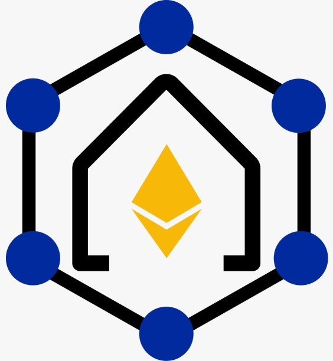
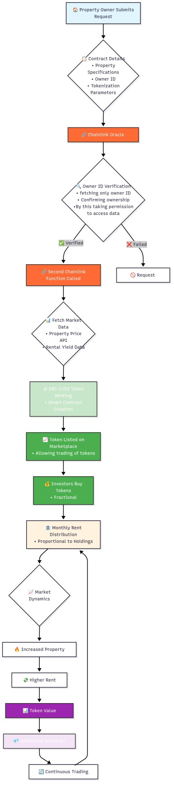

# HomeChain - Decentralized Real Estate Tokenization Platform



## Overview

HomeChain is a revolutionary blockchain-based platform that transforms traditional real estate investment by enabling fractional ownership through ERC-1155 tokens. Our system leverages Chainlink oracles for secure property verification and real-time market data, creating a transparent, accessible, and liquid real estate investment ecosystem.

## Key Features

- **Decentralized Verification**: Chainlink oracles ensure authentic property ownership verification
- **Real-Time Market Data**: Automated property pricing and rental yield fetching
- **ERC-1155 Tokenization**: Fractional ownership with smart contract automation
- **Automated Rent Distribution**: Monthly rental income distributed proportionally to token holders
- **Secure Access Control**: Random access codes for tenant rent payments
- **Dynamic Value Appreciation**: Token values increase with property demand and rent growth
- **Global Accessibility**: Invest in real estate markets worldwide with low barriers to entry

## System Architecture

### Smart Contract Ecosystem

```
HomeChain Platform
├── Verification Contract (0x41F27361e47264a6d833aAdccb786A7E3281ed7a)
│   ├── Property Owner ID Verification
│   ├── Chainlink Oracle Integration
│   └── Ownership Authentication
├── PropertyData Contract (0x14807D88a03b2A339456638A20631eCB7832a447)
│   ├── Market Price Fetching
│   ├── Rental Yield Data
│   └── Property Valuation
└── RealEstate Main Contract (0x477776da7d16723264f28a4319F23cA0e2F277eF)
    ├── ERC-1155 Token Minting
    ├── Rent Distribution Logic
    ├── Access Code Generation
    └── Token Trading Management
```

### Process Flow



1. **Property Submission**: Owner submits property details and tokenization request
2. **Verification**: Chainlink oracle verifies owner ID and property ownership
3. **Data Fetching**: Secondary Chainlink function retrieves market pricing and rental data
4. **Token Minting**: ERC-1155 tokens created with 100 token fixed supply per property
5. **Marketplace Listing**: Tokens listed for trading on decentralized exchanges
6. **Investment**: Users purchase fractional ownership tokens
7. **Access Code**: Random one-time access code generated for tenant rent payments
8. **Rent Distribution**: Monthly rental income distributed proportionally to token holders
9. **Value Growth**: Property demand increases token value and rental yields

## Technology Stack

- **Blockchain**: Ethereum Sepolia Testnet
- **Smart Contracts**: OpenZeppelin Wizard + Chainlink Standard Functions
- **Token Standard**: ERC-1155 (Fractional Ownership)
- **Oracles**: Chainlink Functions for external data
- **Payment Currency**: ETH
- **Frontend**: HTML/CSS/JavaScript

## Project Structure

```
HomeChain/
├── dashboard/
│   ├── abi.json
│   ├── bg.png
│   ├── index.html
│   └── index2.js
├── main_page/
│   ├── bg_main_page.png
│   ├── index.html
│   └── Main_Page.png
├── marketplace/
│   ├── abi.json
│   ├── bg.png
│   ├── index.html
│   └── index.js
├── mint1/
│   ├── abi.json
│   ├── bg.png
│   ├── index.html
│   └── index.js
├── mint2/
│   ├── abi.json
│   ├── bg.png
│   ├── index.html
│   └── index.js
├── mint3/
│   ├── bg.png
│   └── index.html
├── mint4/
│   ├── bg.png
│   └── index.html
├── mint6/
│   ├── bg.png
│   └── index.html
├── rent/
│   ├── abi.json
│   ├── bg.png
│   ├── index.html
│   └── index.js
└── README.md
```

## Smart Contract Addresses (Sepolia Testnet)

| Contract | Address | Purpose |
|----------|---------|---------|
| **Verification** | `0x41F27361e47264a6d833aAdccb786A7E3281ed7a` | Property & Owner Verification |
| **PropertyData** | `0x14807D88a03b2A339456638A20631eCB7832a447` | Market Data & Pricing |
| **RealEstate (Main)** | `0x477776da7d16723264f28a4319F23cA0e2F277eF` | Token Minting & Management |

## API Integration

**Sample Data API**: [https://github.com/ShyamBhalodiya/API/tree/main](https://github.com/ShyamBhalodiya/API/tree/main)

Our verification process uses this hosted API to validate property IDs and corresponding owner IDs, ensuring secure and accurate property tokenization.

## Getting Started

### Prerequisites

- Node.js (v16+)
- MetaMask wallet
- Sepolia ETH for gas fees
- Git

### Installation

1. **Clone the repository**
   ```bash
   git clone https://github.com/Shyam-1407/homechain.git
   cd homechain
   ```

2. **Install dependencies**
   ```bash
   npm install
   ```

3. **Configure MetaMask**
   - Add Sepolia Testnet to MetaMask
   - Get testnet ETH from Sepolia faucet
   - Import the provided contract ABIs

4. **Start the application**
   ```bash
   # For development
   npm run dev
   
   # For production build
   npm run build
   ```

### Usage

#### For Property Owners:
1. Navigate to the minting section
2. Submit property details and ownership documents
3. Wait for Chainlink verification
4. Receive tokenized property with access codes
5. Distribute access codes to tenants

#### For Investors:
1. Browse available tokenized properties in marketplace
2. Purchase fractional ownership tokens
3. Receive monthly rental income automatically
4. Trade tokens on secondary markets

#### For Tenants:
1. Receive access code from property owner
2. Use access code to pay rent through the platform
3. Payment automatically distributed to token holders

## Security Features

- **Chainlink Oracle Verification**: Decentralized property and owner verification
- **Smart Contract Auditing**: Built with OpenZeppelin security standards
- **Access Control**: Random one-time access codes for rent payments
- **Transparent Transactions**: All transactions recorded on blockchain
- **Multi-layer Verification**: Property ID and Owner ID cross-validation

## Token Economics

- **Token Supply**: 100 tokens per property (fixed)
- **Token Standard**: ERC-1155 (supports both fungible and non-fungible features)
- **Revenue Distribution**: Monthly rent distributed proportionally
- **Value Appreciation**: Token prices increase with property demand
- **Trading**: Immediate liquidity through DEX integration

## Future Roadmap

- [ ] **Governance Features**: Token holder voting on property decisions
- [ ] **Multi-chain Support**: Expand to Polygon, BSC, and other networks
- [ ] **DeFi Integration**: Lending, borrowing, and yield farming features
- [ ] **Cross Chain Yield**: Claiming yield from one chain onto another
- [ ] **Property Management**: Integrated property management tools

## Acknowledgments

- **Chainlink**: For providing reliable oracle services
- **OpenZeppelin**: For secure smart contract libraries
- **Ethereum**: For the foundational blockchain infrastructure

**Built with love by the HomeChain Team**
